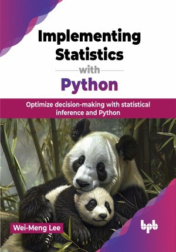

# Implementing Statistics with Python

Optimize decision-making with statistical inference and Python.

This is the repository for [Implementing Statistics with Python
](https://bpbonline.com/products/implementing-statistics-with-python?variant=43948865716424),published by BPB Publications.

## About the Book
Statistics is an important skill set to have when working as a quality analyst, a mathematician, a data analyst, a software engineer, or any analytical job.  This book, "Implementing Statistics with Python," will teach you the basics of statistics and how to use Python to analyze data. You will learn to find patterns, quantify uncertainty, and make data-driven predictions with confidence. 

You will start with basic statistics and then use Python libraries like NumPy and Pandas for data manipulation. You will also learn data visualization with Matplotlib and Seaborn to create informative charts. The book covers probability theory and statistical inference to help you make data-driven decisions. You will be exploring regression and time series analysis with ARIMA for forecasting. Finally, the book introduces ML algorithms, preparing you for real-world data science projects.

The book focuses on applying statistics rather than theory, using popular libraries like NumPy, SciPy, Pandas, Matplotlib, and Scikit-Learn. Reading this book will give you a good foundation for working with ML, business analytics, and data-driven business challenges.

## What You Will Learn
• Learn the fundamentals of Python and its libraries like Numpy, Pandas, Matplotlib and Seaborn.

• Grasp descriptive statistics and probability concepts.

• Perform statistical inference with Chi-square, ANOVA, and regression analysis.

• Skillfully navigate multivariate and time series analysis.

• Apply statistical techniques in practical ML.
